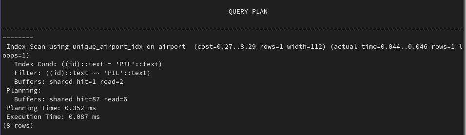
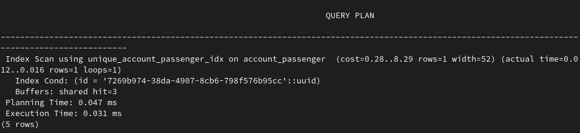
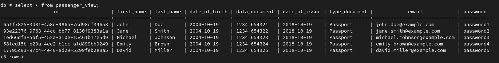

# lab3

## Поднятие базы данных

    docker compose up -d

## Подключение к базе данных

    psql -U user -d db -p 5432 -h 127.0.0.1

## Инициализация базы данных и заполнение данными

Инициализация базы данных.

    ./init.sh

Заполение данных из sql.

    ./add_values.sh

Создание view.

    ./create_view.sh

Создание индексов.

    ./create_index.sh

Или

    ./init.sh && ./add_values.sh && ./create_view.sh && ./create_index.sh

## Результаты

C airport

C account_passenger

View

## Удаление docker контейнера

    docker compose down -v
