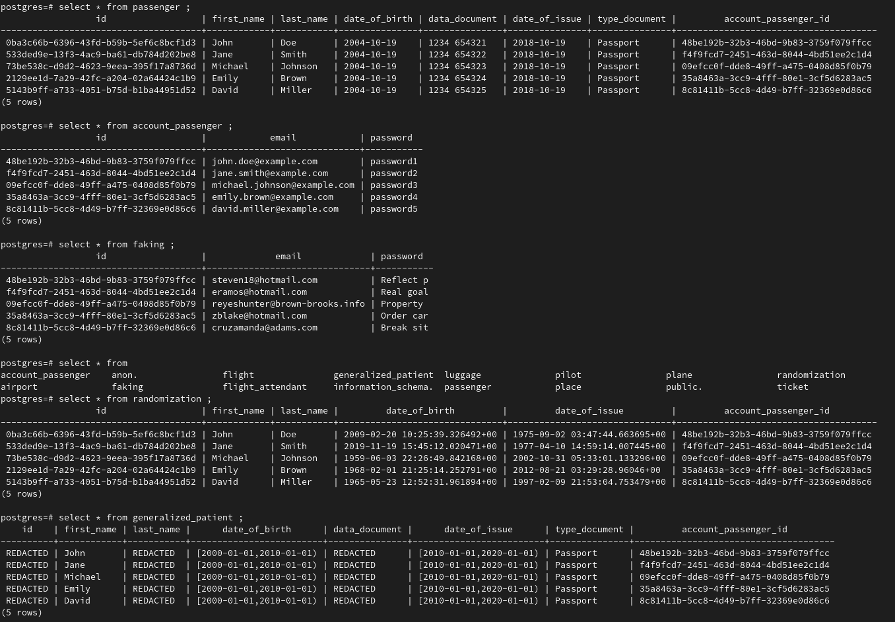

# lab3

## Поднятие базы данных

    docker compose up -d

## Подключение к базе данных

    psql -U user -d db -p 5432 -h 127.0.0.1

## Инициализация базы данных и заполнение данными

Инициализация базы данных.

    ./init.sh

Создание Anonymizers.

    ./create_mview.sh

## Результаты

Были использованы:
* Generalization (в passenger)
* Randomization (в passenger)
* Faking (в account_passenger)

По итогу, есть нужный частичный функционал в разный аномайзерах.
И если использовать их, то вместе. Потому что где-то есть шифрование даты, где-то есть шифрование имени и фамилии пользователя, где-то есть скрытие каких-то полей.

## Удаление docker контейнера

    docker compose down -v
