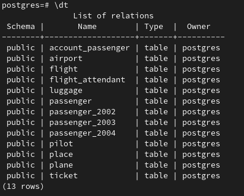
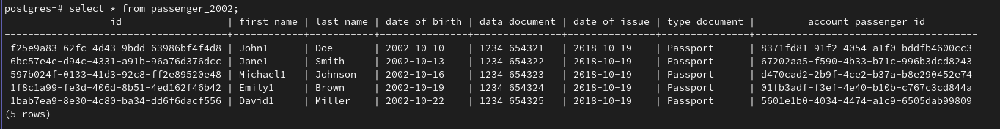

# lab5

## Поднятие базы данных

    docker compose up -d

## Подключение к базе данных

    psql -U postgres -d postgres -p 5432 -h 127.0.0.1

## Инициализация базы данных и заполнение данными

Инициализация базы данных.

    ./init.sh

Создание партицирования.

    ./partitions.sh

## Результаты

Просмотр таблиц после создания партицирования.

Просмотр таблицы, убеждаюсь что данные сделаны верно.

## Удаление docker контейнера

    docker compose down -v
